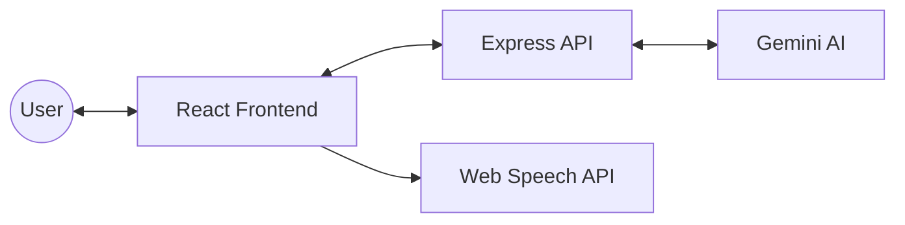

# 🏗️ Architecture: VoteWise

This document outlines the technical architecture of VoteWise and how the different components interact.

## 🌉 System Overview

VoteWise follows a classic Client-Server architecture with a React-based frontend and an Express-based backend that interfaces with Google's Gemini Pro API.

## 🧠 AI Integration

### System Prompts
The backend (`server/src/lib/countryPrompts.ts`) maintains specialized system instructions for each supported country. These prompts ensure the AI:
- Remains non-partisan.
- Focuses on official electoral processes.
- Cites official sources like the Election Commission of India or the FEC in the USA.

### Conversational Context
We maintain chat history on the client-side and send the relevant window of messages to the server. The server strips non-essential model messages (like the initial welcome) before sending to Gemini to ensure the history always starts with a `user` role, as required by the API.

### Streaming Logic
To provide a responsive experience, the server uses **Chunked Transfer Encoding**.
1. The client sends a request.
2. The server calls `chat.sendMessageStream`.
3. As Gemini generates tokens, the server immediately writes these chunks to the HTTP response stream.
4. The frontend (via `axios` or `fetch` with a reader) processes these chunks and updates the Zustand store in real-time.

## 🎨 UI Design System

VoteWise uses a **Glassmorphic Design System**:
- **Transparency**: Uses backdrop-blur and semi-transparent colors.
- **Layers**: Subtle borders and shadows create depth.
- **Micro-interactions**: Framer Motion is used for layout transitions, button hovers, and message entry animations.
- **Themes**: Full support for System, Light, and Dark modes via `next-themes`.

## 🔊 Accessibility (Read Aloud)

The "Read Aloud" feature utilizes the browser's native **Web Speech API (`window.speechSynthesis`)**.
- **Voice Selection**: It automatically filters for premium/high-quality voices (like Google's Natural voices).
- **Language Matching**: It dynamically sets the `lang` attribute (en-US, hi-IN, gu-IN) based on the message's language to ensure correct pronunciation.
- **Control**: Users can play, pause, and stop the speech at any time.

## 🛠️ State Management

**Zustand** is used for global state:
- `useChatStore`: Manages the message history, current language, selected country, and streaming status.
- `useTheme`: Managed by `next-themes` for appearance settings.

## 🛡️ Security & Validation

- **Zod**: All incoming API requests are validated using Zod schemas (`server/src/middleware/validate.ts`).
- **CORS**: Restricted to the frontend's dev/prod origin.
- **Rate Limiting**: Implemented via custom in-memory middleware to prevent API abuse and protect Gemini quotas (10 requests/min).
